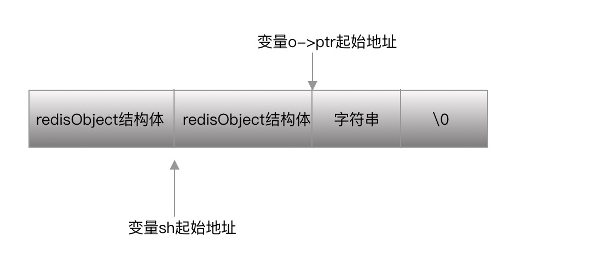

## 内存友好型数据结构设计
### 1. 简介
本节主要为总结redis各类数据结构在在设计上如何做到性能与查询效率的平衡

### 2. 数据结构设计
redis为客户端提供的类型主要为string, list, hash, set, zset, geo, hyperloglog等，其中redis
的底层数据结构有sds, list, hash, intset, ziplist, skiplist, redis为了将数据类型与底层数据结构
做映射处理，开发了redisObject数据结构，简单来说，redisObject是上层数据类型和底层数据结构的桥梁，redisObject
数据结构如下
```C
typedef struct redisObject {
    unsigned type:4;
    unsigned encoding:4;
    unsigned lru:LRU_BITS; /* LRU time (relative to global lru_clock) or
                            * LFU data (least significant 8 bits frequency
                            * and most significant 16 bits access time). */
    int refcount;
    void *ptr;
} robj;
```
其中最终要的两个字段为type,encoding
type代表了面向客户端的数据类型，例如string, set等
encoding代表了面向底层的数据结构，例如 embstr, rawstr, hash等

#### 2.1 string数据类型底层数据结构的初始化
我们知道string底层有多种类型数据结构，比如embstr, rawstr, long。那么这些类型是何时使用的呢，本小节将做详细分析
创建string类型的字符串主要为函数[createStringObject](), 主要源码如下
```C
#define OBJ_ENCODING_EMBSTR_SIZE_LIMIT 44
robj *createStringObject(const char *ptr, size_t len) {
    if (len <= OBJ_ENCODING_EMBSTR_SIZE_LIMIT)
        return createEmbeddedStringObject(ptr,len);
    else
        return createRawStringObject(ptr,len);
}
```
该函数会依据创建的字符串长度判断使用哪种数据类型，如果长度小于44字节，则调用函数createEmbeddedStringObject，否则调用createRawStringObject, 下面将着重分析这两个函数
- createEmbeddedStringObject, 该底层数据结构为OBJ_ENCODING_EMBSTR, 在分配内存时将redisObejct头占用的内存空间和真正存储数据的内存空间作为一块连续的内存空间进行申请，以此来减少内存分配耗时和内存碎片的产生。最终产生的结构体布局如下

```C
/* Create a string object with encoding OBJ_ENCODING_EMBSTR, that is
 * an object where the sds string is actually an unmodifiable string
 * allocated in the same chunk as the object itself. */
robj *createEmbeddedStringObject(const char *ptr, size_t len) {
    robj *o = zmalloc(sizeof(robj)+sizeof(struct sdshdr8)+len+1);
    struct sdshdr8 *sh = (void*)(o+1);

    o->type = OBJ_STRING;
    o->encoding = OBJ_ENCODING_EMBSTR;
    o->ptr = sh+1;
    o->refcount = 1;
    if (server.maxmemory_policy & MAXMEMORY_FLAG_LFU) {
        o->lru = (LFUGetTimeInMinutes()<<8) | LFU_INIT_VAL;
    } else {
        o->lru = LRU_CLOCK();
    }

    sh->len = len;
    sh->alloc = len;
    sh->flags = SDS_TYPE_8;
    if (ptr == SDS_NOINIT)
        sh->buf[len] = '\0';
    else if (ptr) {
        memcpy(sh->buf,ptr,len);
        sh->buf[len] = '\0';
    } else {
        memset(sh->buf,0,len+1);
    }
    return o;
}
```
- createRawStringObject，该函数底层的数据类型为OBJ_STRING, 涉及两次内存分配，。从源码中我们可以看到第一次内存分配发生在sdsnewlen, 第二次内存分配发生在createObject中创建redisObject结构体
```C
/* Create a string object with encoding OBJ_ENCODING_RAW, that is a plain
 * string object where o->ptr points to a proper sds string. */
robj *createRawStringObject(const char *ptr, size_t len) {
    return createObject(OBJ_STRING, sdsnewlen(ptr,len));
}

robj *createObject(int type, void *ptr) {
    robj *o = zmalloc(sizeof(*o));
    o->type = type;
    o->encoding = OBJ_ENCODING_RAW;
    o->ptr = ptr;
    o->refcount = 1;

    /* Set the LRU to the current lruclock (minutes resolution), or
     * alternatively the LFU counter. */
    if (server.maxmemory_policy & MAXMEMORY_FLAG_LFU) {
        o->lru = (LFUGetTimeInMinutes()<<8) | LFU_INIT_VAL;
    } else {
        o->lru = LRU_CLOCK();
    }
    return o;
}
```
#### 2.2 ziplist数据结构设计
ziplist是redis为了节省内存开销的另一个数据结构，该结构应用在hash, list, zset, set数据类型中。
数据定义如下
```C

```
#### 2.3 intset数据结构设计

### 3. 总结

### 4. 参考


